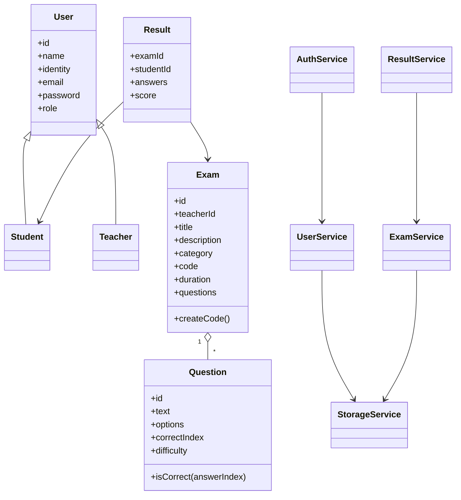

# ExamSystem - מערכת מבחנים צד לקוח

פרויקט דפדפן מלא המבוסס על ES Modules, מחלקות OOP, JSON ו-localStorage.

## דפים וניווט

- `index.html` - דף ראשי עם פרטי מגישים, קישור GitHub, הרשמה והתחברות.
- `regiseter.html` - הרשמת מורה או סטודנט.
- `login.html` - התחברות והפניה לפי תפקיד.
- `teacher.html` - דף מורה: יצירת מבחנים, צפייה ברשימת מבחנים ומחיקה.
- `exam_details.html` - ניהול מבחן בודד: מידע כללי, שאלות ותוצאות סטודנטים.
- `student.html` - דף סטודנט: היסטוריית מבחנים, ציונים וממוצע.
- `search.html` - חיפוש מבחנים לפי שם, קוד או קטגוריה.
- `take_exam.html` - ביצוע מבחן, טיימר, שליחה ושמירת ציון.

## פיצ'רים

- הרשמה והתחברות לפי תפקיד.
- התנתקות מכל הדפים.
- יצירת מבחנים על ידי מורה.
- הוספה, עריכה ומחיקה של שאלות אמריקאיות.
- חיפוש מבחן לפי שם, קוד או קטגוריה.
- ביצוע מבחן על ידי סטודנט.
- חישוב ציון ושמירת תוצאות.
- צפייה בהיסטוריית ציונים ובממוצע.
- צפייה של המורה בתוצאות הסטודנטים.
- טיימר למבחן.
- רמות קושי לשאלות.
- מצב כהה.
- נתוני דוגמה למורה.

## מבנה תיקיות

```text
ExamSystem/
  index.html
  regiseter.html
  login.html
  teacher.html
  exam_details.html
  student.html
  search.html
  take_exam.html
  css/
    style.css
  js/
    app/
      bootstrap.js
      index.js
      register.js
      login.js
      teacher.js
      exam_details.js
      student.js
      search.js
      take_exam.js
    models/
      User.js
      Student.js
      Teacher.js
      Exam.js
      Question.js
      Result.js
    services/
      StorageService.js
      UserService.js
      AuthService.js
      ExamService.js
      ResultService.js
      ThemeService.js
    ui/
      navbar.js
      message.js
      examUI.js
      studentUI.js
      teacherUI.js
```

## פורמט JSON ב-localStorage

המפתחות נשמרים עם prefix בשם `examSystem`.

### משתמשים - `examSystem:users`

```json
[
  {
    "id": "uuid",
    "name": "Student Name",
    "identity": "123456789",
    "email": "student@mail.com",
    "password": "1234",
    "role": "student",
    "createdAt": "2026-07-11T00:00:00.000Z"
  }
]
```

### מבחנים - `examSystem:exams`

```json
[
  {
    "id": "uuid",
    "teacherId": "uuid",
    "title": "מבוא ל-JavaScript",
    "description": "מבחן דוגמה",
    "category": "תכנות",
    "code": "ABC123",
    "duration": 30,
    "questions": [
      {
        "id": "uuid",
        "text": "מהי מילת הייצוא?",
        "options": ["export", "send", "module", "public"],
        "correctIndex": 0,
        "difficulty": "easy"
      }
    ],
    "createdAt": "2026-07-11T00:00:00.000Z"
  }
]
```

### תוצאות - `examSystem:results`

```json
[
  {
    "id": "uuid",
    "examId": "uuid",
    "studentId": "uuid",
    "answers": {
      "question-id": 0
    },
    "score": 100,
    "correctCount": 1,
    "totalQuestions": 1,
    "submittedAt": "2026-07-11T00:00:00.000Z"
  }
]
```

### משתמש מחובר - `examSystem:currentUser`

נשמר אובייקט משתמש יחיד או נמחק בעת התנתקות.

## UML - מחלקות עיקריות



## Flows מרכזיים

### הרשמה והתחברות

1. המשתמש ממלא טופס ב-`regiseter.html`.
2. `register.js` קורא ל-`UserService.create`.
3. המשתמש נשמר ב-`localStorage`.
4. `AuthService.login` שומר את המשתמש המחובר.
5. מתבצעת הפניה ל-`teacher.html` או `student.html`.

### יצירת מבחן

1. מורה נכנס ל-`teacher.html`.
2. `AuthService.requireRole('teacher')` מוודא הרשאה.
3. הטופס שולח נתונים ל-`ExamService.save`.
4. המבחן נשמר ב-`examSystem:exams`.
5. המורה עובר ל-`exam_details.html` כדי להוסיף שאלות.

### ביצוע מבחן

1. סטודנט מחפש מבחן ב-`search.html`.
2. לחיצה על מבחן מעבירה ל-`take_exam.html?id=...`.
3. `take_exam.js` מציג שאלות וטיימר.
4. בסיום, `ResultService.submit` מחשב ציון.
5. התוצאה נשמרת ומוצגת לסטודנט ולמורה.

## קומיטים מומלצים להגשה

```bash
git checkout -b exam-system-client
git add index.html regiseter.html login.html css/style.css
git commit -m "Create base pages and shared styles"

git add js/models js/services
git commit -m "Add OOP models and localStorage services"

git add teacher.html exam_details.html js/app/teacher.js js/app/exam_details.js js/ui
git commit -m "Add teacher exam management flow"

git add student.html search.html take_exam.html js/app/student.js js/app/search.js js/app/take_exam.js
git commit -m "Add student search and exam taking flow"

git add README.md
git commit -m "Add technical README and UML documentation"
```

## הרצה

בגלל שימוש ב-ES Modules מומלץ להריץ דרך שרת מקומי:

```bash
python -m http.server 8000
```

ואז לפתוח:

```text
http://localhost:8000
```

## GitHub Pages

לאחר העלאה ל-GitHub:

1. Settings
2. Pages
3. Source: branch `main` או `exam-system-client`
4. Folder: `/root`
5. שמירה וקבלת קישור deploy
